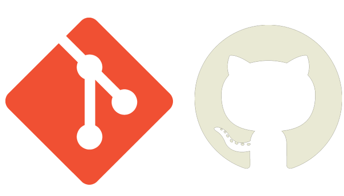
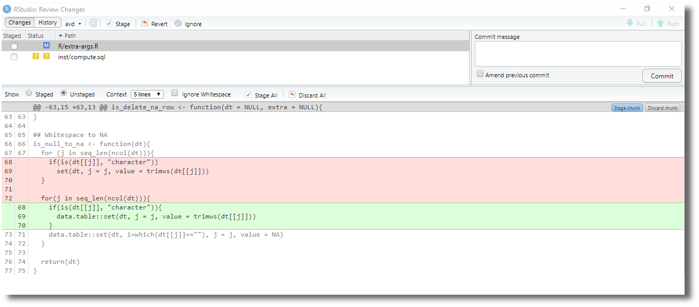
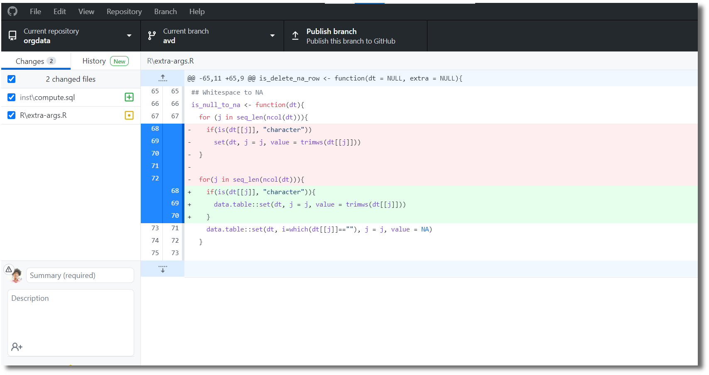
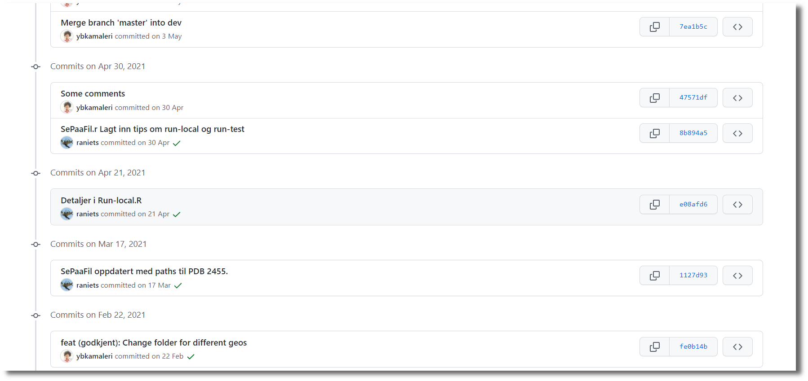
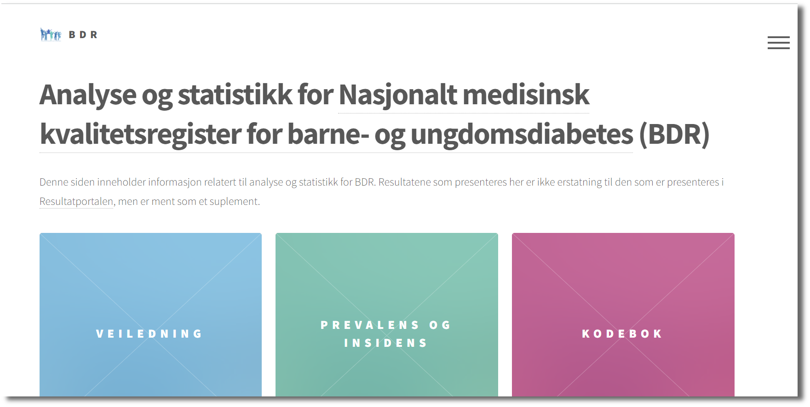
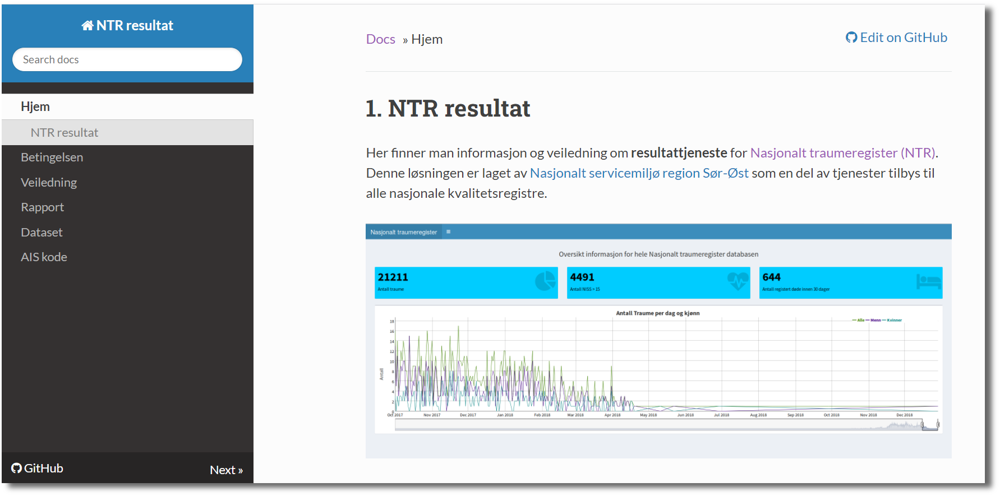

class: inverse, left, middle, hide_logo
background-image: url(https://source.unsplash.com/wX2L8L-fGeA)
background-size: cover

```{r xaringanExtra, echo = FALSE}
xaringanExtra::use_logo(
  image_url = "images/fhi_logo_lang.png",
  link_url = "https://www.fhi.no",
  position = xaringanExtra::css_position(top = "1em", right = "1em")
)
xaringanExtra::use_progress_bar(color = "#0051BA", location = "top")
xaringanExtra::use_panelset()
xaringanExtra::use_tile_view()
xaringanExtra::use_fit_screen()
```

```{r setup, echo = FALSE}
image_link <- function(image,url,...){
  htmltools::a(
    href=url,
    htmltools::img(src=image,...)
  )
}
```

# Git og Github


### Et system for versjonskontroll og deling av kode, men...
### Hva er vitsen?

.large[Yusman Kamaleri | Avdelingsseminar | Leangkollen 29-30 nov. 2021]


---
class: hide_logo
background-image: url(images/github-changes.png)
background-size: 650px
background-position: right

# Plan
 - Hva er Git?
 
 - Hva er Github?

 - Hvordan bruker vi dem


--

# Betingelse
 - Tekst f.eks `.sps`, `.do`
 
--
 
 - Nysgjerrig
 
```{r curious, out.width = '10%', echo = FALSE}


```

---
background-image: url(images/softwarecenter.png)
background-size: 850px
background-position: center

# Git

---
background-image: url(images/softwarecenter2.png)
background-size: cover
background-position: center

# Git


---
background-image: url(images/file-changes.png)
background-size: 700px
background-position: right

# Hvorfor

- Spore endringer (versjonering)
  - enkeltvis
--
 
 - gruppevis

???
- Gruppevis
  - Datarensing
  - Analyse 1
  - Svar til reviewer

---

# Hvordan
Spore endringer lokalt

.panelset[
.panel[.panel-name[Terminal]
```
git init
git add filename.do
git commit -m "Finn årsak til bla..bla.."
git status
git diff
git log
```

Mer forklaring i [freeCodeCamp](https://www.freecodecamp.org/news/git-cheat-sheet/)

]

.panel[.panel-name[RStudio]

```{r rstudio, out.width = '90%', echo = FALSE}

```

]

.panel[.panel-name[GitHub Desktop]

```{r gitdesk, out.width = '90%', echo = FALSE}

```
]
]

---
background-image: url(images/github-site.png)
background-size: 950px
background-position: center

# GitHub

---
background-image: url(images/github-site2.png)
background-size: cover
background-position: center

# GitHub

---
# Hvorfor
- Samarbeide med andre
- Åpenhet

???
- Åpen institutt
- Åpen forskning
- Åpen som mulig og lukker når nødvendig


---

# Hvordan

Lage profil (gratis) på [https://github.com](https://github.com)


```{r commit, out.width = '90%', echo = FALSE}

```

---
background-image: url(images/logos.png)
background-size: 300px
background-position: 750px 150px

# Folkehelseprofiler

KHfunctions

[https://github.com/helseprofil/khfunctions](https://github.com/helseprofil/khfunctions)

orgdata

[https://helseprofil.github.io/orgdata](https://helseprofil.github.io/orgdata/)

norgeo

[https://helseprofil.github.io/norgeo](https://helseprofil.github.io/norgeo/)


---

# Annnen bruk

.pull-left[
Kvalitetsregister for barne-og ungdomdiabetes [(BDR)](https://bdreg.github.io/)

```{r out.width = '90%', echo = FALSE}
## 
image_link("images/bdr.png", url = "https://bdreg.github.io")
```
]

.pull-right[
Nasjonalt traumeregister [(NTR)](https://ybkamaleri.github.io/traume/)

```{r out.width = '90%', echo = FALSE}
## 
image_link("images/traume.png", url = "https://ybkamaleri.github.io/traume")
```
]

---
class: left, hide_logo
background-image: url(https://source.unsplash.com/BjQTmNKlawg)
background-position: right
background-size: contain 

# Verd å lese

.pull-left[
- [Happy Git and GitHub for the useR](https://happygitwithr.com/index.html)
- [Intro to GitHub for Social Scientists Using Stata and Dropbox](https://usermanual.wiki/Pdf/githubmanual.2125143468/help)
]
