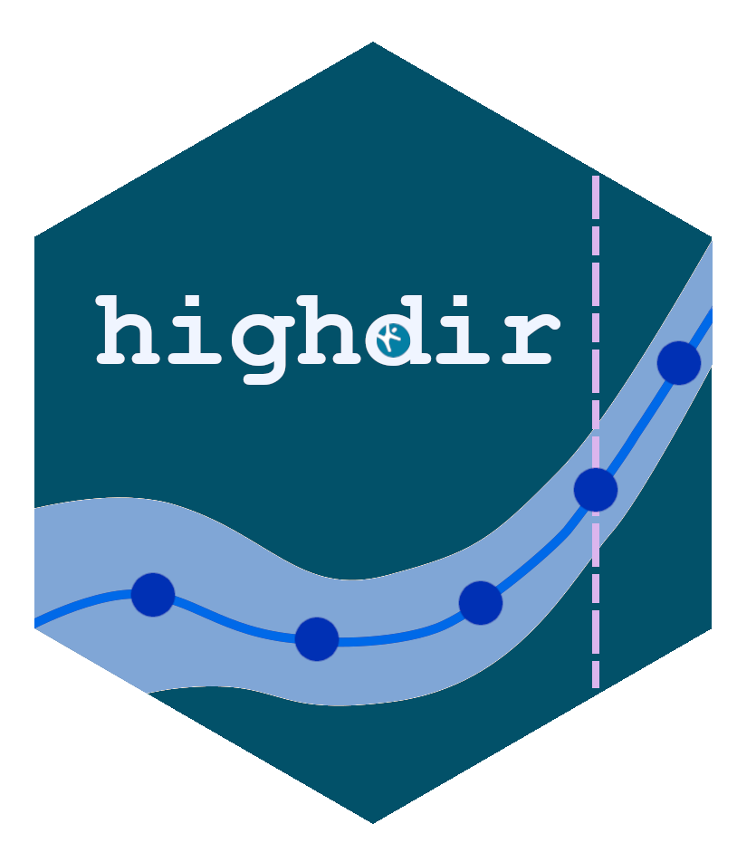
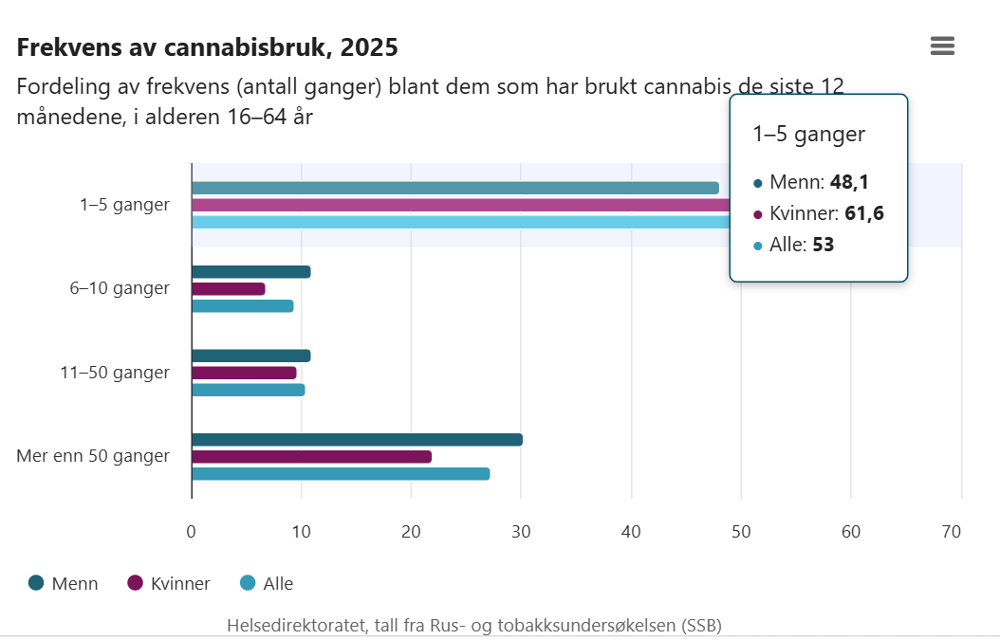
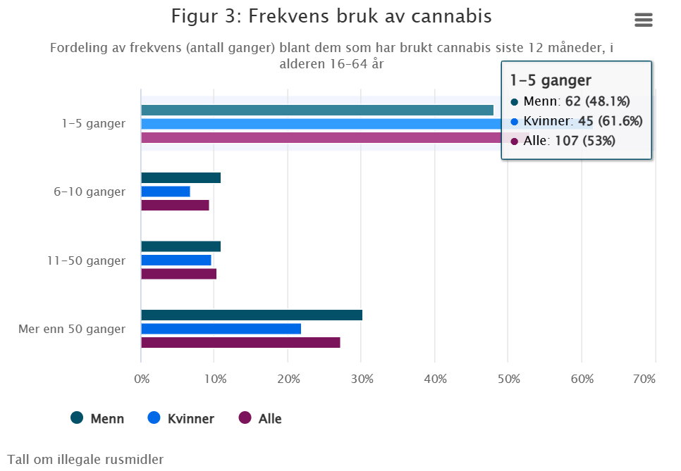
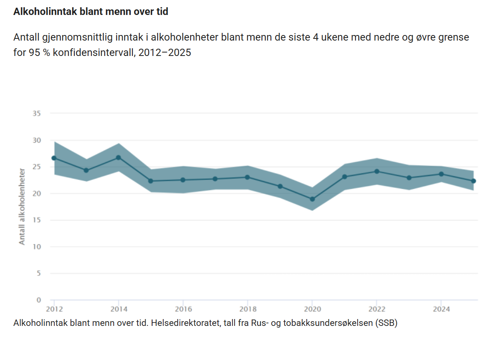
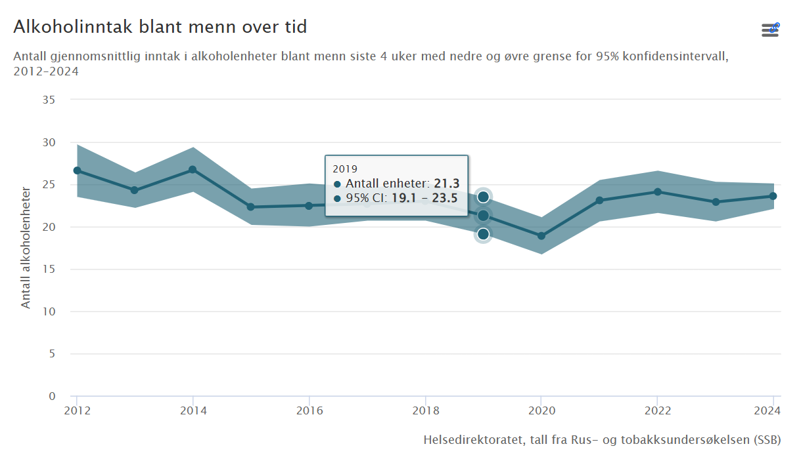
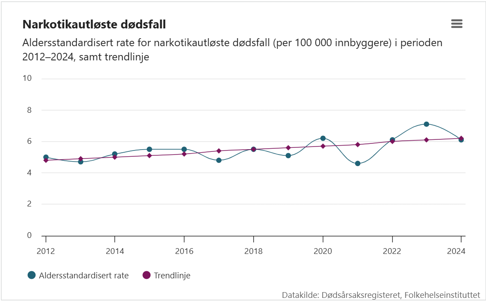
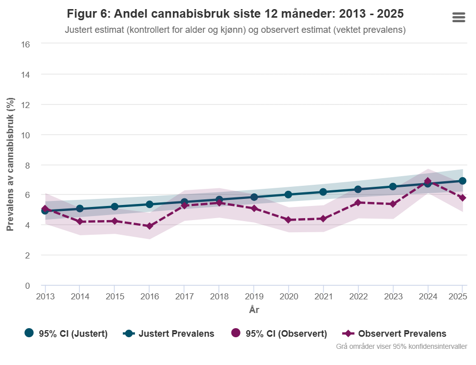
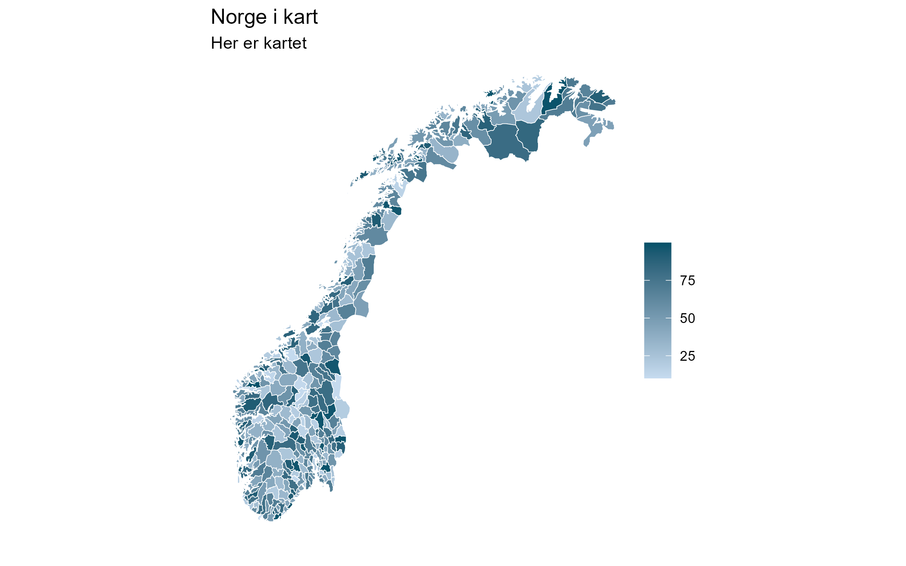

##  {.hide-logo .center} 

:::: {.columns}
::: {.column width="45%"}
{width="100%"}
:::

::: {.quarter-y .column width="60%"}
**En diagramdefinisjon.**

**To renderere.**

**Konsistent figur, hver gang. 🤞**
:::
::::

## Hdir mal

 Kan kun vise enten antall eller andel, ikke begge deler samtidig.
[](https://www.helsedirektoratet.no/rapporter/tall-om-illegale-rusmidler/cannabis/bruk-av-cannabis-i-befolkningen)

## highdir

[](https://folkehelsestats.github.io/toir/rapport2026)

## Hdir KI 
 Kan ikke vise interaktivt konfidensintervall
[](https://www.helsedirektoratet.no/rapporter/tall-om-alkohol/alkoholbruk/hvor-mye-og-hva-drikker-vi)

## highdir KI

[](https://folkehelsestats.github.io/toa/reports/2025/#alkoholenheter-siste-4-uker)

## Hdir trend
[](https://www.helsedirektoratet.no/rapporter/tall-om-illegale-rusmidler/narkotikautloste-dodsfall-i-norge)

## highdir trend
[](https://folkehelsestats.github.io/toir/rapport2026#test-for-trend-for-cannabisbruk-siste-12-m%C3%A5neder){width=80%}

## Hdir krav

- Enkel å bruke
- Tilgjengelig for alle, også til ikke R-brukere
- Universell utformet
- Kompatibel med skjermlesere
- Benytter [Hdir fargepalett](https://designsystem.helsedir.no/0410c9e94/p/45aee7-farger)
- Støtter [Highcharts](https://www.highcharts.com/)

## highdir-modus

En felles **diagramstil-motor** - en måte å beskrive et diagram på og to måter å rendere det på

- **Dynamisk** : [highcharter](https://jkunst.com/highcharter/)
- **Statisk** : [ggplot2](https://ggplot2.tidyverse.org/), [eulerr](https://jolars.github.io/eulerr/reference/euler.html) m.fl.

Støtter bl.a søyle-, stablet søyle-, punkt-, linje-, kake- og Venn-diagrammer

## Praktisk eksempel 

```{r}
#| echo: true
#| eval: false
#| code-line-numbers: "2|4-11|13|14"
#| code-fold: show 

library(highdir)
region <- rio::import("region-data.xlsx")

spec <- hd_spec(region, x = "region", y = "rate", n = "n")

opts <- hd_opts(
  title    = "Health indicator by region",
  subtitle = "Source: Norwegian Directorate of Health",
  ylab     = "Rate per 100 000",
  flip     = TRUE
)

hd_make(spec, "ranked_bar", opts, mode = "dynamic")
hd_make(spec, "ranked_bar", opts, mode = "static")
```

## Dynamisk

```{r}
#| echo: true
#| eval: false
#| code-fold: show 

hd_make(spec, "ranked_bar", opts, mode = "dynamic", vs = "Oslo", aim = 60)
```

```{r}
#| echo: false
#| eval: true
#| out-height: "30%"

library(highdir)
region <- rio::import("dataset/region-data.xlsx")

spec <- hd_spec(region, x = "region", y = "rate", n = "n")

opts <- hd_opts(
  title    = "Health indicator by region",
  subtitle = "Source: Norwegian Directorate of Health",
  ylab     = "Rate per 100 000",
  flip     = TRUE
)

hd_make(spec, "ranked_bar", opts, mode = "dynamic", vs = "Oslo", aim = 60)
```

Informasjon vises i tooltip.

## Statisk

```{r}
#| echo: true
#| eval: false
#| code-fold: show 

hd_make(spec, "ranked_bar", opts, mode = "static", vs = "Oslo", aim = 60)
```

```{r}
#| echo: false
#| eval: true

library(highdir)
region <- rio::import("dataset/region-data.xlsx")

spec <- hd_spec(region, x = "region", y = "rate", n = "n")

opts <- hd_opts(
  title    = "Health indicator by region",
  subtitle = "Source: Norwegian Directorate of Health",
  ylab     = "Rate per 100 000",
  flip     = TRUE
)

hd_make(spec, "ranked_bar", opts, mode = "static", vs = "Oslo", aim = 60)
```

All informasjon er inkludert i den statiske figuren.

## GUI

Grafisk grensesnitt, kan du kjøre:

```{r}
#| echo: true
#| eval: false
#| code-fold: show 

hd_app()
```

Eller bruk direkte fra Shiny server

[https://ybkamaleri.shinyapps.io/highdir/](https://ybkamaleri.shinyapps.io/highdir/)

## Status 

- [Hjemmeside](https://folkehelsestats.github.io/highdir/)
- [CRAN](https://cran.r-project.org/web/packages/highdir/index.html)
- [Awesome](https://github.com/erikgahner/awesome-ggplot2#interactive)

## Skjermlesing

Figurer er tilgjengelige for personer med nedsatt syn og andre synsutfordringer.

```{r}
#| echo: true
#| eval: false
#| code-fold: show 
#| code-line-numbers: "11-14"

library(highdir)

opts <- hd_opts(
  title       = "Alcohol consumption over time",
  subtitle    = "Source: Norwegian Directorate of Health",

  # Visible below the chart — for citations and footnotes
  caption     = "Data: Hdir annual report 2023. Adjusted for population age.",

  # Read by screen readers only — describes what the chart shows
  description = paste(
    "Line chart showing adjusted mean alcohol consumption in Norway from",
    "2010 to 2023. Consumption peaked at 7.3 litres per capita in 2014 and",
    "declined steadily to 5.3 litres by 2023."
  )
)

```


## Utvikling

Kart visning

```{r}
#| echo: true
#| eval: false
#| code-fold: show 
#| code-line-numbers: "3-4|6|7"

dt <- readRDS(file = "kommuner.RDS")

spec <- hd_spec(dt, x = "code", y = "value")
opts <- hd_opts(title = "Norge i kart", subtitle = "Her er kartet")

hd_make(spec, "map", opts, map_src = hd_map_no("municipality"), mode = "dynamic")
hd_make(spec, "map", opts, map_src = hd_map_no("municipality"), mode = "static")
```


## Visning 

:::: {.columns}
::: {.center .column width="50%"}
**[Dynamisk](https://folkehelsestats.github.io/levekaar/kommuner)**
```{=html}
<iframe width="780" height="500" src="https://folkehelsestats.github.io/levekaar/kommuner" title="Kommuner"></iframe>
```
:::

::: {.center .column width="50%"}
**Statis**
{width="100%"}
:::
::::

## API

**Deklarativt**
```{r}
#| echo: true
#| eval: false
#| code-fold: true 

spec <- hd_spec(df, x = "age", y = "pct", group = "sex", n = "n")

opts <- hd_opts(title = "Tall om Report",
                subtitle = "Source: Example data",
                caption  = "Tall om helse",
                ylim = c(0, 80))

hd_make(spec, "column", opts, mode = "static")
hd_make(spec, "line", opts, smooth = TRUE)         
```

**Lagdelt**
```{r}
#| echo: true
#| eval: false
#| code-fold: true 

hd(df, x = "age", y = "pct", group = "sex", n = "n") +
  hd_geom_column() +
  hd_opts(title = "Tall om Report",
          subtitle = "Source: Example data",
          caption  = "Tall om helse",
          ylim = c(0, 80))
```
